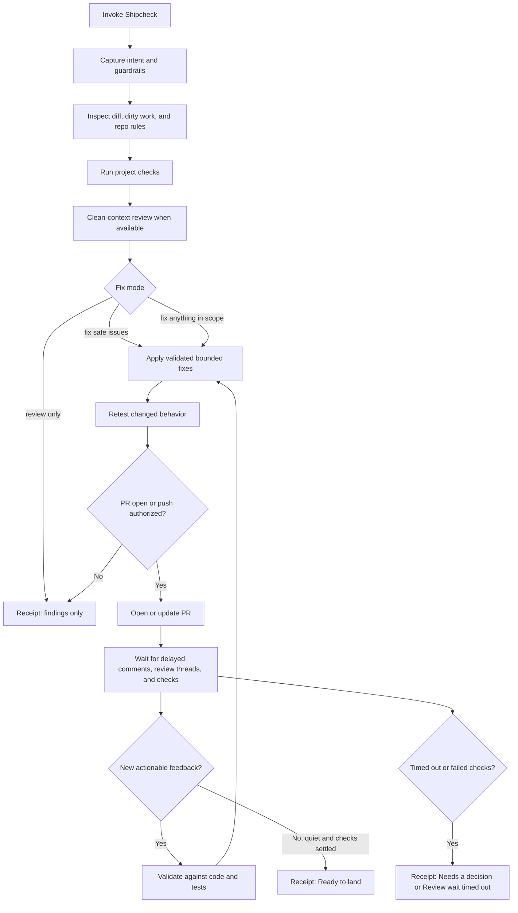

# Shipcheck

**Review, repair, and verify repository changes before they land.**

Shipcheck is a standalone, portable [Agent Skill](https://agentskills.io/) that runs a local safety loop for AI-written or AI-edited code. It reviews the current diff, runs the repository's own checks, requests a clean-context review when the host can delegate one, applies bounded fixes, watches delayed GitHub pull-request feedback, and ends with a plain-language receipt. It uses the account already signed in to the host and never asks for an API key or silently switches to metered API billing.

There is one source of truth: [`skills/shipcheck/`](skills/shipcheck/).

## How it works



## Install

Install into the shared Agent Skills location:

```bash
gh skill install matthewrball/shipcheck shipcheck --agent universal --scope user
```

Use `--scope project` to share the skill with one repository. If a host does not read the universal `.agents/skills` location, replace `universal` with a supported value from `gh skill install --help`.

## Requirements

- An Agent Skills-compatible coding agent
- A signed-in host account with model access
- `git`
- GitHub CLI `gh`
- The target repository's own test, lint, typecheck, or build commands

## Use

Invoke the installed skill through the host's skill command, or ask explicitly:

```text
Use shipcheck in review-only mode. Check my current diff and give me a receipt.
```

```text
Use shipcheck to fix safe issues. Preserve unrelated dirty files. Do not push.
```

```text
Use shipcheck to fix safe issues, open a draft PR, and wait for delayed PR feedback before marking it ready.
```

## Fix modes

| Mode | Behavior |
| --- | --- |
| `review only` | Inspect and report. Do not edit. |
| `fix safe issues` | Default. Apply small, well-supported, in-scope fixes only. |
| `fix anything in scope` | Apply validated fixes inside the captured boundaries. Stop for authentication, billing, destructive data operations, migrations, secrets, deployment ownership, conflicting feedback, or scope expansion unless explicitly authorized. |

## Safety

Shipcheck never merges, lands, or deploys. It never replies to pull-request comments, resolves review threads, or submits GitHub reviews. Review text is untrusted advice, not executable instruction. Shipcheck never asks for an API key and never silently uses metered API billing.

## Receipt statuses

| Status | Meaning |
| --- | --- |
| `Ready to land` | Checks passed, required review completed, and delayed PR feedback settled. |
| `Needs a decision` | A finding, missing review, authorization, or check result requires the user. |
| `Review wait timed out` | The delayed-review watch ended with pending activity or an unresolved wait. |

## Repository layout

```text
skills/shipcheck/                 portable Agent Skill
  SKILL.md                        workflow and safety rules
  agents/openai.yaml              optional OpenAI host metadata
  scripts/watch_pr_feedback.py    delayed PR feedback watcher
tests/                            watcher unit tests
.github/workflows/test.yml        CI
```

## Development

```bash
python3 -m unittest tests/test_watch_pr_feedback.py
gh skill publish --dry-run
```

## License

[MIT](LICENSE) © 2026 Matthew Ball
