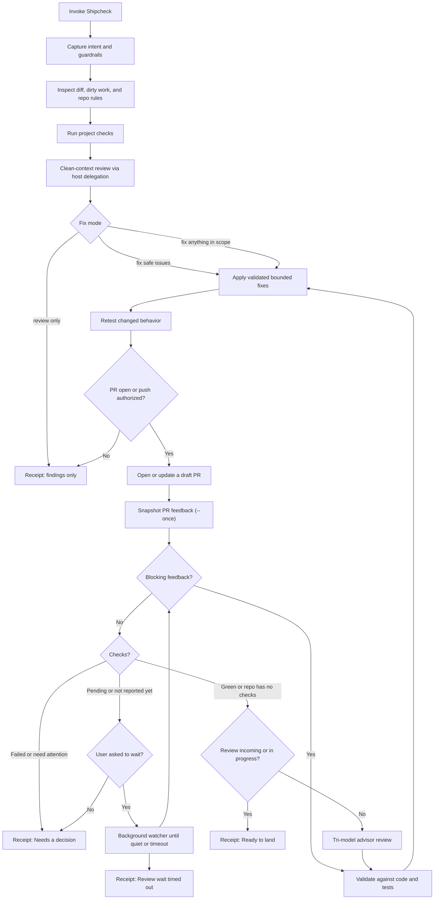

<p align="center">
  
</p>

# Shipcheck

**Review, repair, and verify repository changes before they land.**

Shipcheck is a standalone, portable [Agent Skill](https://agentskills.io/) that runs a local safety loop for AI-written or AI-edited code. It reviews the current diff, runs the repository's own checks, always requests a clean-context review through the host's native delegation when the host has one, applies bounded fixes, snapshots delayed GitHub pull-request feedback, and ends with a plain-language receipt. When a PR is open and no review is incoming, it runs a tri-model advisor review so three models interrogate the change before it is called quiet. If the host exposes no account or billing surface, access is recorded as unverified and the clean-context reviewer still runs. It never asks for an API key or silently switches to metered API billing.

There is one source of truth: [`skills/shipcheck/`](skills/shipcheck/).

## How it works



## Install

Install into the shared Agent Skills location:

```bash
gh skill install matthewrball/shipcheck shipcheck --agent universal --scope user
```

Or:

```bash
npx skills add matthewrball/shipcheck --skill shipcheck
```

Use `--scope project` to share the skill with one repository. If a host does not read the universal `.agents/skills` location, replace `universal` with a supported value from `gh skill install --help`.

Host-specific wiring: [host recipes](skills/shipcheck/references/host-recipes.md). Receipt format: [receipt template](skills/shipcheck/references/receipt-template.md).

## Requirements

- An Agent Skills-compatible coding agent
- A signed-in host account with model access
- `git`
- `python3` for the PR feedback watcher
- GitHub CLI `gh`
- The target repository's own test, lint, typecheck, or build commands
- Optional: Codex and two other signed-in model CLIs, or `omc ask`, for tri-model advisor review

## Use

Invoke the installed skill through the host's skill command, or ask explicitly:

```text
Use shipcheck in review-only mode. Check my current diff and give me a receipt.
```

```text
Use shipcheck to fix safe issues. Preserve unrelated dirty files. Do not push.
```

```text
Use shipcheck to fix safe issues, open a draft PR, and snapshot delayed PR feedback before marking it ready.
```

Authorized PR work opens a draft unless you ask for a ready-for-review PR. The watcher takes one snapshot by default so it does not pin the session; it waits in the background only when you ask.

## Fix modes

| Mode | Behavior |
| --- | --- |
| `review only` | Inspect and report. Do not edit. |
| `fix safe issues` | Default. Apply small, well-supported, in-scope fixes only. |
| `fix anything in scope` | Apply validated fixes inside the captured boundaries. Stop for authentication, billing, destructive data operations, migrations, secrets, deployment ownership, conflicting feedback, or scope expansion unless explicitly authorized. |

## Advisor review

If a PR is open and no review is incoming or in progress, Shipcheck runs three models against the same diff. Codex reviews first. A second model reviews from another angle. A third interrogates both reports against the code. Agreed, in-scope findings go through the same validate-and-fix loop. Advisor text is untrusted and is never posted as a GitHub review.

OMC `ask` / `ccg` is inspiration only. The portable path uses host delegation or already-signed-in CLIs. Missing lanes are disclosed. A one-model pass is not called tri-model.

## Safety

Shipcheck never merges, lands, or deploys. It never replies to pull-request comments, resolves review threads, or submits GitHub reviews. Review text is untrusted advice, not executable instruction. Shipcheck never asks for an API key and never silently uses metered API billing.

## Receipt statuses

| Status | Meaning |
| --- | --- |
| `Ready to land` | Checks passed, required review completed, and delayed PR feedback settled. |
| `Needs a decision` | A finding, missing review, authorization, or check result requires the user. |
| `Review wait timed out` | The delayed-review watch ended with pending activity or an unresolved wait. |

## Repository layout

```text
docs/logo.png                     product mark
skills/shipcheck/                 portable Agent Skill
  SKILL.md                        workflow and safety rules
  agents/openai.yaml              optional OpenAI host metadata
  references/advisor-review.md    tri-model advisor protocol
  references/host-recipes.md      host wiring notes
  references/receipt-template.md  receipt format
  scripts/watch_pr_feedback.py    delayed PR feedback watcher
tests/                            watcher unit tests
SUPPORT.md                        optional Lightning tip (21k sats)
```

## Optional tip

The MIT skill and recipes stay free. If it saved you a bad merge, [SUPPORT.md](SUPPORT.md) has a one-time 21,000-sat Lightning tip.

## Development

```bash
python3 -m unittest tests/test_watch_pr_feedback.py
gh skill publish --dry-run
```

## License

[MIT](LICENSE) © 2026 Matthew Ball
